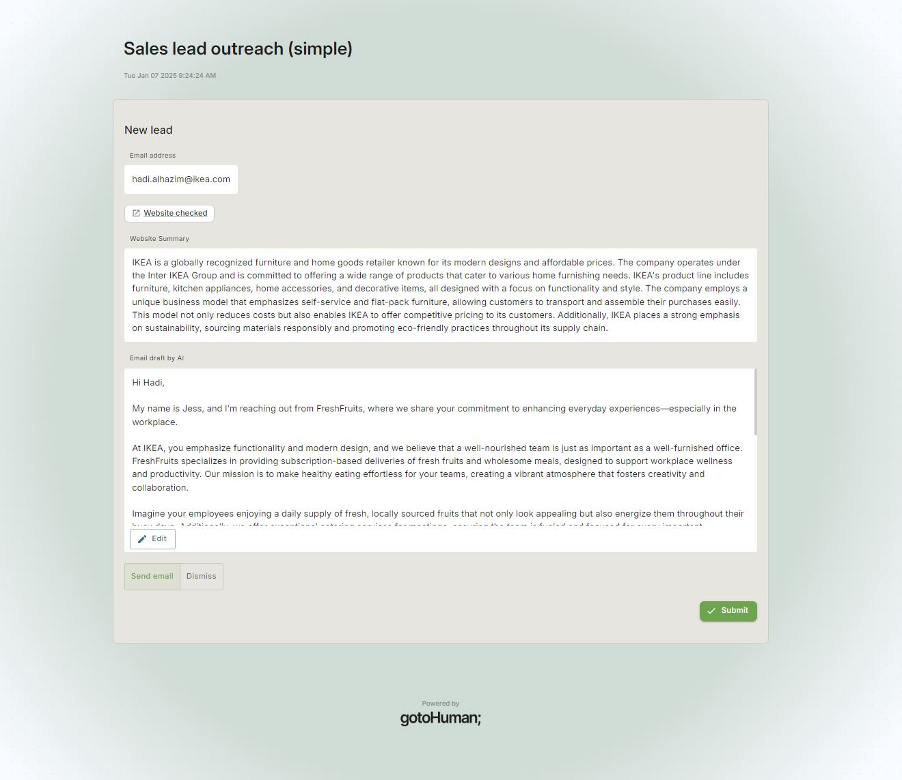

# LangGraph | gotoHuman

An AI agent [built with LangGraph](https://langchain-ai.github.io/langgraphjs/) integrating [gotoHuman](https://gotohuman.com) to keep a **human in the loop**.

[gotoHuman](https://gotohuman.com) provides you with a central dashboard to review AI‑generated content, approve critical actions or provide input. And it seamlessly integrates with the AI stack of your choice.  

This example workflow uses our [Typescript SDK](https://github.com/gotohuman/gotohuman-js-sdk).

It takes the email address of a new sales lead and drafts a personalized initial email outreach. The draft is reviewed and revised by a human before it gets sent out.

## Set it up

### Create a review form

In gotoHuman, you can simply import the form template used here with the ID `OmmAnhbnWmird3oz60q2`.  
For the webhook, enter the URL where you deploy this app. It is called for each review response to resume your graph.  

Reviewers will find new pending reviews in their [gotoHuman inbox](https://app.gotohuman.com). You can also opt-in to receive a short-lived public link that you can freely send to reviewers.

### Deploy this agent

Clone this Next.js repo, deploy it (e.g. to Vercel) and set up your environment variables

```
OPENAI_API_KEY = sk-proj-XXX
GOTOHUMAN_API_KEY=XYZ
GOTOHUMAN_FORM_ID=abcdef123
POSTGRES_CONN_STRING="postgres://..."
```

### Run it

Trigger your agent whenever you get your hands on a new email address:

#### Manually in gotoHuman
Create a new trigger form with a text input field with ID `email` and include the same webhook as above. You'll see a trigger button appear in gotoHuman.

#### Via API
`HTTP POST [DEPLOY_URL]/api/agent`
```json
{
  "email": "new.lead@email.com"
}
```

Find a new request for review in your gotoHuman inbox as soon as the agent is done with its' research, drafted an outreach message and needs approval.

